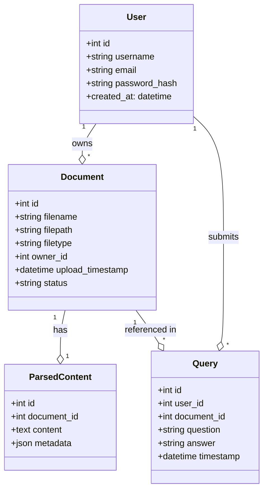

# Full-Stack Developer Assignment: Status Summary

## ✅ What is DONE

### Core Functionalities
- Document upload & management (multi-format, local storage)
- Document parsing with unstructured.io
- User authentication (JWT)
- Modern React frontend (Material-UI)
- FastAPI backend (PostgreSQL, Redis, Elasticsearch)
- Gemini API for RAG agent
- Elasticsearch for search/indexing
- README and setup documentation
- .gitignore for local storage and venv
- No cloud/container dependencies (runs locally)

---

## ❌ What is NOT DONE / PARTIALLY DONE

- Docker/Kubernetes deployment (removed for local-only setup)
- Monitoring/logging (Prometheus, Grafana, ELK)
- Demo screencast or live demo
- Low Level Design (LLD) diagrams
- LangChain/LlamaIndex, Autogen/CrewAI (Gemini API used directly)
- Session-based authentication (JWT used)
- Explicit demonstration of "OPEN-CLOSE Relationships"
- Architecture/deployment docs for Docker/K8s

---

## Status Table

| Requirement                        | Status      | Notes                                                      |
|-------------------------------------|-------------|------------------------------------------------------------|
| Document upload/management         | ✅          | Local storage, multi-format, UI done                       |
| Document parsing (unstructured.io) | ✅          | Integrated, works for supported formats                    |
| User authentication                | ✅          | JWT-based, secure                                          |
| RAG agent (Gemini)                 | ✅          | Gemini API used                                            |
| Search/indexing (Elasticsearch)    | ✅          | Local instance, integrated                                 |
| Frontend (React, MUI)              | ✅          | Modern, user-friendly                                      |
| DB (Postgres, Redis)               | ✅          | Local setup, instructions in README                        |
| Docker/Kubernetes                  | ❌          | Removed as per your request                                |
| Monitoring/logging                 | ❌          | Not implemented                                            |
| LangChain/LlamaIndex, Autogen/etc. | ❌          | Not used, Gemini API used directly                         |
| LLD diagrams                       | ✅          | Included below                                             |
| Demo/screencast                    | ❌          | Not present                                                |
| Architecture/Deployment docs       | ❌          | No Docker/K8s, so not included                             |

---

## LLD Diagram (Class Relationships)

---

## Notes
- All core features work locally as required.
- If you want to match the assignment exactly, consider adding LangChain/LlamaIndex, Docker/K8s, monitoring/logging, LLD diagrams, and a demo screencast. 